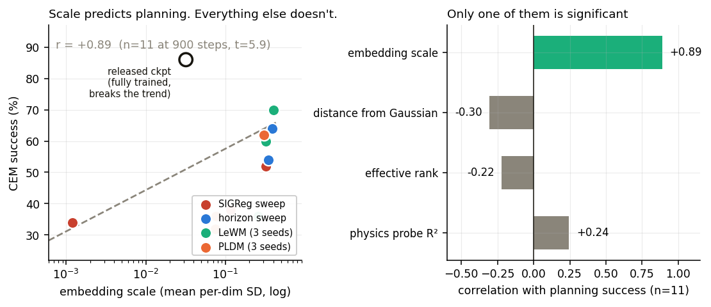
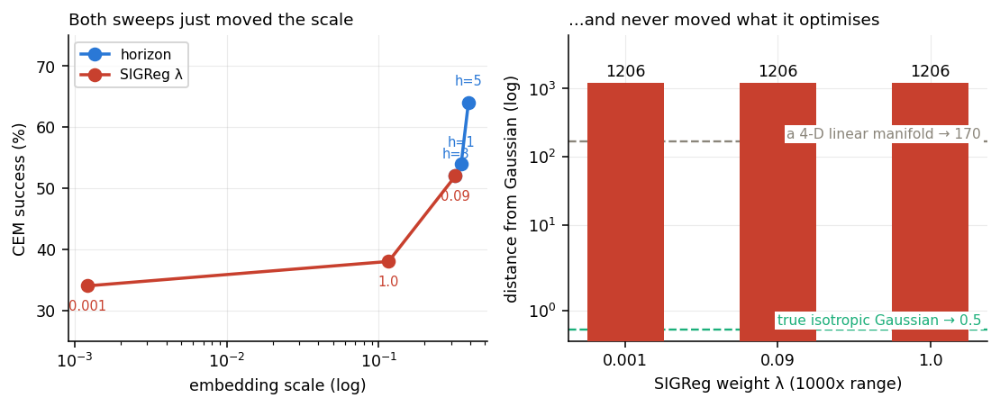

# Experiment 4 — what actually decides whether planning works?

**English** · [中文](README.md)

> This one diagnoses the other three. It trains nothing — it takes low-variance
> measurements on the 12 checkpoints that already exist, and finds that
> **the first three experiments were all measuring the same confound without
> knowing it.**

## Why run it

All three earlier experiments used CEM planning success as the primary metric,
and that metric's noise (±19pp) is larger than their effect sizes (2–18pp). The
obvious fix is more seeds, but that only brute-forces the noise.

The actual question came from two claims in the paper's abstract that pull in
opposite directions:

> SIGReg drives the embedding toward an **isotropic Gaussian** — equal variance
> in all directions, no correlation between dimensions.
>
> "LeWM's latent space encodes meaningful **physical structure** through probing
> of physical quantities."

The physical state of tworoom is intrinsically low-dimensional (agent xy +
target xy). Embedding that in 192 dimensions and then forcing isotropy either
destroys the geometry, or is a harmless whitening, or dilutes the signal with
nuisance directions. **Which one is an empirical question the paper does not
sweep.**

So: a different set of metrics, all computed on 3000 held-out frames, with far
less variance than a 50-episode success rate.

| metric | what it is |
|---|---|
| `gauss_stat` | Epps-Pulley normality statistic — **the thing SIGReg claims to optimise** |
| `probe_r2` | held-out R² of ridge regression `embedding → agent position` — the paper's own probing |
| `eff_rank` | participation ratio of the covariance eigenvalues — dimensions actually in use |
| `emb_mean_std` | mean per-dimension SD — the representation's absolute scale |

`gauss_stat` was calibrated against known distributions first: a true isotropic
Gaussian gives 0.5, a 4-D linear manifold embedded in 192-D gives 170.6, and
effective rank recovers 3.93. The instrument works.

## Results

| checkpoint | scale | eff. rank | dist. from Gaussian | probe R² | success |
|---|---|---|---|---|---|
| SIGReg λ=0.001 | 0.0012 | 7.40 | 1206 | 0.467 | 34% |
| SIGReg λ=0.09 (default) | 0.3191 | 4.14 | 1206 | 0.497 | 52% |
| SIGReg λ=1.0 | 0.1160 | 5.71 | 1206 | 0.515 | 38% |
| h=1 | 0.3482 | 3.81 | 1206 | 0.525 | 54% |
| h=5 | 0.3886 | 3.98 | 1204 | 0.506 | 64% |
| LeWM s0 / s1 / s2 | 0.259 / 0.324 / 0.401 | 5.12 / 3.54 / 3.98 | ~1205 | 0.584 / 0.523 / 0.475 | 36 / 60 / 70% |
| PLDM s0 / s1 / s2 | 0.074 / 0.076 / 0.307 | 1.82 / 2.08 / 2.29 | ~1200 | 0.410 / 0.427 / 0.500 | 32 / 36 / 62% |
| released, fully trained | 0.0319 | 1.66 | 1204 | 0.493 | 86% |

## Finding 1: scale decides planning, not representation quality

Correlation with success across the 11 checkpoints trained for 900 steps:

| metric | r | significance |
|---|---|---|
| physics probe R² ("is the information there") | +0.24 | not significant |
| effective rank | −0.22 | not significant |
| distance from Gaussian | −0.30 | not significant |
| **embedding scale** | **+0.89** | **t = 5.85, significant** |



**How much physical information the representation carries barely relates to
whether it can plan. Its absolute scale is what decides.**

The mechanism: CEM picks actions by comparing distances in embedding space.
Shrink the signal while the predictor's error stays put and the cost landscape
drowns in noise — **planning fails from a collapsed signal-to-noise ratio, not
from missing information.**

This overturns the explanation I wrote in experiment 3. The collapsed
checkpoint probes at R² = 0.467 against 0.497 for the healthy one — **the
position information is nearly intact.** A linear probe is scale-invariant; the
directional structure is still there.

## Finding 2: the first three experiments moved one variable, unknowingly



**Experiment 1**: the success ordering (52, 54, 64) matches the scale ordering
(0.319, 0.348, 0.389) exactly. I read h=5's 64% as "more context helps
prediction", but "that init happened to give a larger scale" explains it just as
well — and has r=0.89 behind it.

**Experiment 3**: the inverted U in success (34, 52, 38) is the same shape as
the inverted U in scale (0.0012, 0.319, 0.116). One variable, again.

**Experiment 2**: the stable group difference was there the whole time in a
column I wasn't looking at — PLDM systematically suppresses scale by ~4x
(0.074/0.076 against 0.259/0.324/0.401). Its one good seed (62%) is the one
whose scale jumped to 0.307, into LeWM's range. **A difference visible at a
glance with a low-variance metric stayed invisible across six runs of the
success-rate measurement.**

The point: **more seeds would not have rescued these experiments.** Forty-five
seeds buys a precise estimate of a confounded quantity.

## Finding 3: SIGReg is not doing what it says

Across the whole λ sweep, `gauss_stat` reads **1206 / 1206 / 1206** — a
thousandfold change in weight moves the distance from Gaussian not at all.
References: a true Gaussian is 0.5, a 4-D linear manifold is 170.

The learned representation is therefore ~2400x further from isotropic Gaussian
than a Gaussian, 7x further than a 4-D linear manifold, and **uses about 4 of
its 192 dimensions.**

That is not a failure — tworoom's state is ~4-dimensional, and learning a
compact low-dimensional manifold is the right thing to do. But it means
**SIGReg's operative effect is maintaining embedding scale**
(0.0012 → 0.319 → 0.116), **not Gaussianisation.** The mechanism the paper names
and the mechanism doing the work are not the same.

Which incidentally resolves the tension this experiment started from: **the two
claims don't conflict, because the Gaussianisation never happens.** The
representation keeps its physical structure (R² ≈ 0.5) precisely because it was
never really isotropised.

## Finding 4: the released checkpoint is an instructive exception

Its scale is 0.032 — an order of magnitude below every healthy model I trained —
and its effective rank is 1.66, the lowest here. **It still scores 86%.**

So "scale decides" holds only among **undertrained** models. With enough
training the predictor's error drops and a small scale stops mattering; the
model settles into an extremely compact (1.66-dimensional) but accurate
representation.

**That may be what "sufficiently trained" actually means here**: not a bigger
representation, but predictions precise enough to match how fine-grained the
representation already is. A 900-step model can only outrun its own prediction
noise by inflating the scale.

## Reproducing

```bash
./run.sh          # inference only, no retraining, ~15 minutes
```

Raw output in `results/probe_physics.json`.

## Why this one earns its place

The first three ask "change a thing, watch a downstream number." This one asks
"what determines that downstream number in the first place." Only the second
question explains why the first three measured nothing — and it is far cheaper,
since it runs on checkpoints that already exist.

Done again, this would be experiment **one**.
