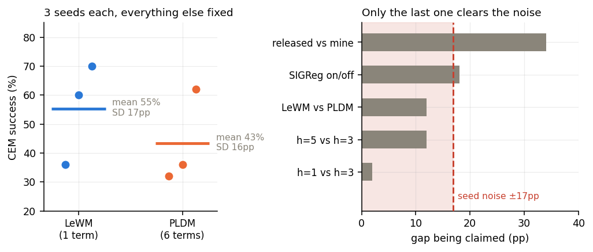

# world-models-study

[English](README_en.md) · **中文**

两种世界模型，先复现，再拆开验证。

**Dreamer** 通过重建观测来学习潜在动力学，然后让策略完全在这个模型的想象里训练。
**JEPA**——LeCun 一直主张的那条路线——干脆丢掉重建，只在表征空间里预测，规划放到测试时用搜索完成。
这两条路线通常被当作对立的哲学来讨论。这个仓库记录的是：我把其中一条从零写了一遍，把另一条跑通，
然后花时间去试图推翻后者的核心主张。

结论的短版本：**预测 loss 最低的那个 checkpoint，encoder 已经塌缩了。**
它的 loss 是 0.004，比正常模型好 60 倍，而 192 维 embedding 里有 69 维方差趋近于零——
这正是论文里那个正则项要防的失败模式。我没有靠 loss 曲线去推断，而是直接把它测了出来。

还有一个不那么好看但同样重要的结论：**我一开始把噪声当成了发现。**
第二组实验我以为在比架构，后来才想明白 JEPA 这一族方法共享架构、区别在 loss 上——
我只换了模型类没换 loss，等于两组跑的都是同一个东西。

重做之后（真的换了防塌缩机制，每组 3 个 seed），得到了这个项目最有价值也最扫兴的数字：
**同一配置、只换随机种子，规划成功率能从 36% 跑到 70%，组内标准差 ±17 个百分点。**
要在这个方差下检出 10 个百分点的真实差异，每组需要约 45 个 seed——我原本只有 1 个。



所以这个仓库里**所有基于成功率的比较都落在噪声里**，唯一撑得住的是表征塌缩那组的直接测量。

---

## 目录

| | |
|---|---|
| [`01_dreamer_from_scratch/`](01_dreamer_from_scratch) | 从零手写的 DreamerV2，单文件。RSSM、reward model、actor-critic、imagination rollout。CartPole 上对比 Double-DQN，3 个 seed。 |
| [`02_lewm_reproduction/`](02_lewm_reproduction) | 跑通 [LeWorldModel](https://github.com/lucas-maes/le-wm) 并复现它发布的 checkpoint。这个目录里大部分笔记是关于安装的——时间实际花在了那儿。 |
| [`03_experiments/`](03_experiments) | 我真正在意的部分。三组针对 LeWorldModel 的受控实验。 |
| [`04_analysis/`](04_analysis) | `summary.csv`——每个 checkpoint、每项指标，一张表——以及画图的脚本。 |
| [`05_dreamerv3_scale/`](05_dreamerv3_scale) | 官方 DreamerV3 在 DMC walker-walk 上跑了一整夜，跑到任务天花板。 |
| [`notes/engineering_log.md`](notes/engineering_log.md) | 什么坏了，各花了多少时间。 |
| [`slides/`](slides) | 讲稿（中英双版），中文版附 PDF。 |

## 第一部分 —— 手写 Dreamer

这部分的意义在于：不能躲在别人的 `train.py` 后面。
Encoder、RSSM（GRU 确定性状态 + 32×16 categorical 随机状态，straight-through 梯度）、
reward head、continue head、基于 λ-return 的 actor-critic，以及 imagination rollout，约 670 行。

CartPole-v1，2 万环境步，3 个 seed，对比 Double-DQN：

| | 全程平均评估回报 | 收敛段（最后 3 次评估） |
|---|---|---|
| DreamerV2 | **240.1** | **248.6** |
| Double-DQN | 113.8 | 162.2 |


样本效率的差距是预期内的结果，不是有意思的部分。有意思的是诊断图：
KL 稳定在 0.8 附近（free bits 正在起作用，既没塌缩也没爆炸），
以及**在想象内部**算出的 λ-return 从 0 涨到 70+，与真实表现同步。
后者是在检查一件事——想象出来的轨迹是不是真的对应现实，
还是说模型正舒服地待在自己编造的幻觉里。


### 规模验证

CartPole 能证明组件是对的，但产出不了一条像样的曲线。所以官方
[dreamerv3-torch](https://github.com/NM512/dreamerv3-torch) 也在 DMC walker-walk 上跑了一夜：


5k 步时 31 分，45k 时 568，195k 时 951，之后在 930–955 区间走平，天花板约 1000。
细节和它需要的那一处补丁在 [`05_dreamerv3_scale/`](05_dreamerv3_scale)。

## 第二部分 —— 复现 LeWorldModel

发布的 tworoom checkpoint，用 CEM-MPC 在 50 条留出 episode 上规划：**86% 成功率**。
这是第三部分所有数字的参照基准。

那一夜大约四个小时花在装这个东西上，而不是跑它——缺 `swig`、`datasets` 解析到五年前的版本、
`transformers` 大版本重命名了所有 ViT 权重、HDF5 支持在包里但被一个静默的 `ImportError` 关掉了。
全部写进了 [`02_lewm_reproduction/setup.md`](02_lewm_reproduction/setup.md)——
因为这恰恰是复现类文章通常略过、而实际上真正卡住人的部分。

## 第三部分 —— 三组实验

下面每一组都是：同一份数据、同一个 encoder、同一个优化器、同样 900 步梯度更新、
同一个 CEM 规划器、同样 50 条留出 episode。每组只动一个变量。

### 1. predictor 需要多少上下文？

`history_size` ∈ {1, 3, 5}——predictor 能看到几帧过去的 embedding。


预测误差随上下文单调下降。规划成功率没有跟着走：h=1 → h=3 这一步，
loss 改善了而成功率**掉了**（54% → 52%）。每组 50 条 episode，二项标准误约 7 个百分点，
所以诚实的读法是"h=5 更好，其余是噪声"，而不是一条规律。
而 loss 曲线暗示的东西和评估实际做的事之间这道错位，正是后面两组实验要追的线索。

### 2. 换防塌缩机制（做错一次，重做一次）

原计划是「固定预算只换架构」，做法是改模型配置里的 `_target_`。
**这个设计是错的**——JEPA 这一族方法共享架构，PLDM 和 LeWM 的区别在 loss 上：

| | LeWM | PLDM |
|---|---|---|
| 防塌缩 | SIGReg ×1 | VCReg ×4 + 时序对齐 + 逆动力学 |
| 可调权重 | **1** | **6** |

正对上论文摘要那句 "reduces tunable loss hyperparameters **from six to one**
compared to **the only existing end-to-end alternative**"——那个 alternative 就是 PLDM。
只换模型类而沿用 LeWM 的 loss，等于把 PLDM 抽空，两组跑的都是 LeWM。

重做时顺带修了一个真 bug：`train.py` 调 `spt.Manager` 没传 `seed=`，
权重初始化根本不受控——第一遍那 14 个点的差距就是这么来的。

重做结果（每组 3 个 seed）：

| | 成功率 | 均值 | 组内标准差 |
|---|---|---|---|
| LeWM | 36% / 60% / 70% | 55.3% | 17.5pp |
| PLDM | 32% / 36% / 62% | 43.3% | 16.3pp |

Welch t = 0.87，**远不显著**。方向支持 LeWM，但统计上分不开。

顺带发现 **`pred_loss` 跨模型不可比**：PLDM 的预测 loss 稳定低 13–16 倍，
但它的 embedding 尺度也小得多——按尺度归一化后两者持平（2.84 vs 2.66）。
这是塌缩陷阱的弱化版：不用真塌缩，只要把表征压紧，MSE 就无偿变好看。

细节见 [`03_experiments/exp2_pldm/`](03_experiments/exp2_pldm)。

### 3. 那个正则项，真的在做论文说的事吗？

LeWorldModel 的卖点是两项 loss 就够：next-embedding 预测，
加一个把 embedding 拉向各向同性高斯、使其无法塌缩的 SIGReg 项。默认权重 0.09。我把它扫到 0.001 和 1.0。

**loss 这一列回答不了这个问题**，这正是陷阱所在——encoder 塌缩会让预测变得*更容易*，
所以 `pred_loss` 反而会降。于是我没有去读 loss，而是写了
[`probe_collapse.py`](03_experiments/exp3_sigreg/probe_collapse.py)：
编码 256 帧真实的留出数据，测量每个维度的标准差，数出有多少维实际上已经死了。


权重 0.001 时，**192 维 embedding 里有 69 维在真实数据上方差趋近于零**，
平均标准差 0.0012 对健康时的 0.325——差 270 倍。模型找到了作弊解。
它的 `pred_loss` 是 0.004，比这里训出来的任何东西低两个数量级，而且完全没有意义。

规划成功率掉到 34%，方向一致。但要说清楚：**塌缩本身是直接测量出来的，不是推断的**，
而 52% → 34% 这个具体幅度 p = 0.064，我的评估规模不足以钉死它。
诚实的表述是：关掉正则项导致表征塌缩（已证实），塌缩方向性地损害了规划（一致但欠功效）。

10 倍权重那一头不会塌缩，但 embedding 被压得太紧、失去区分度——38%。

论文选的默认值正好落在这个倒 U 的顶点。这不是空泛的"正则化有用"，
而是一个具体的、已发表的超参数，被拿它自己声称要防的失败模式、按那个失败模式本身的定义验证了一遍。

### 六个 checkpoint 放一起


如果验证 loss 是对的代理指标，这张图应该呈现一条向右下的趋势。它没有——
但要注意，中间那四个点彼此的差距都在噪声里（见实验二），
真正撑起这个结论的是最左边那个塌缩点：loss 最低、规划几乎最差，
而且它的异常有独立的表征测量佐证。

完整数字在 [`04_analysis/summary.csv`](04_analysis/summary.csv)，
显著性检验在 [`04_analysis/significance.py`](04_analysis/significance.py)。

---

## 这是什么，不是什么

**是**：两种世界模型的复现，以及三组每次只动一个变量的受控实验，
其中一组通过测量机制本身、而非测量指标，验证了一个已发表的主张。

**不是**可发表级别的结果，而且短板比我一开始以为的严重得多。

实验二重做时量到的种子方差是 **±17 个百分点**——同配置、只换随机种子，成功率能差 34 个点。
按这个方差，检出 10 个点的真实差异需要每组约 45 个 seed；我的实验一和实验三每组只有 1 个。
**所以这个仓库里所有基于成功率的比较都落在噪声里**，包括实验一的 horizon 扫描
和实验三的 SIGReg 成功率差距。

唯一撑得住的是不依赖成功率的直接测量：塌缩时 embedding 标准差 0.0012 对 0.325（差 270 倍）、
死维度 69 对 0。这两个数是拿真实数据编码后量出来的，不经过 50 条 episode 的采样噪声。

另外也没有做 Dreamer 与 LeWorldModel 的正面对比（目标函数和评估指标不共享），
以及实验二第一遍的设计是错的（细节写在它自己的 README 里）。
Dreamer 那一半更规矩（3 个 seed，外加一条跑到天花板的 walker-walk 完整曲线），但 CartPole 规模有限。
这里没有 Dreamer 与 LeWorldModel 的正面对比，因为二者优化的目标不同
（奖励 vs 与目标 embedding 的距离），评估的指标也不同（累计回报 vs 成功率）；
硬把它们塞进同一根轴，需要一个我没有搭建的共同任务定义。

## 复现

每一部分都有自己的运行脚本。第一部分是自包含的（`pip install gymnasium torch`）；
第二、三部分需要一份 [le-wm](https://github.com/lucas-maes/le-wm) 的 checkout——
**先读 [`02_lewm_reproduction/setup.md`](02_lewm_reproduction/setup.md)**，
截至 2026 年 9 月，默认安装方式是跑不通的。

```bash
cd 01_dreamer_from_scratch && ./run_experiments.sh     # 约 20 分钟，单卡
cd 03_experiments/exp1_horizon && ./run.sh             # 约 15 分钟
cd 03_experiments/exp2_pldm   && ./run.sh              # 约 5 分钟
cd 03_experiments/exp3_sigreg && ./run.sh              # 约 10 分钟
cd 04_analysis && python make_figures.py
```

DreamerV3 那条线是独立的整夜任务，见 [`05_dreamerv3_scale/`](05_dreamerv3_scale)。

硬件：单张 RTX 5880 Ada。一组 LeWorldModel 实验在 batch 128、224px 下峰值约 13 GB；
Dreamer 那一半 2 GB 以内。

## 参考

- Hafner et al., *Mastering Atari with Discrete World Models*（DreamerV2）与
  *Mastering Diverse Domains through World Models*（DreamerV3）
- Maes, Le Lidec, Scieur, LeCun, Balestriero, *LeWorldModel: Stable End-to-End
  Joint-Embedding Predictive Architecture from Pixels*, arXiv:2603.19312
- [NM512/dreamerv3-torch](https://github.com/NM512/dreamerv3-torch)、
  [lucas-maes/le-wm](https://github.com/lucas-maes/le-wm)、
  [galilai-group/stable-worldmodel](https://github.com/galilai-group/stable-worldmodel)
